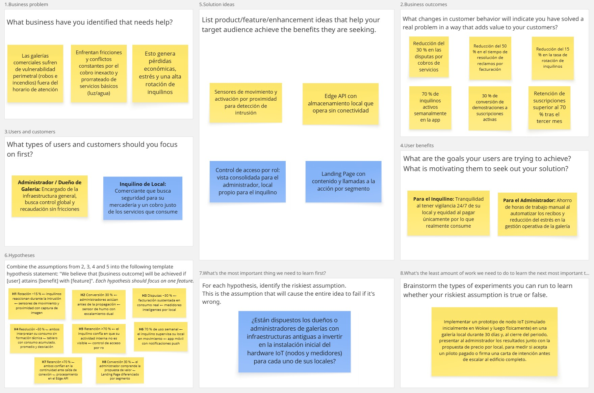

### 1.2.2. Lean UX Process

En esta sección se detalla el proceso de trabajo aplicado por el equipo para StorePulse. Mediante un enfoque ágil y colaborativo, las creencias iniciales del equipo sobre el negocio y sus usuarios se declararon de forma explícita y se convirtieron en hipótesis verificables. Este proceso permite alinear los resultados esperados del negocio con las necesidades del administrador de galería y del inquilino de local, garantizando que las funcionalidades propuestas respondan a un beneficio identificado y no a una suposición no examinada.

#### 1.2.2.1. Lean UX Problem Statements

Se elabora un único Problem Statement para todo el proyecto, considerando ambos segmentos objetivo, según la plantilla *Brand new initiative*.

El estado actual de **la gestión operativa de galerías comerciales en Lima Metropolitana** se ha enfocado principalmente en **la vigilancia presencial de áreas comunes, la inspección manual periódica y el prorrateo estimado de los servicios básicos, atendiendo a administradores e inquilinos únicamente después de que un incidente ha ocurrido**.

Lo que los productos y servicios existentes no logran atender es **la ausencia de medición individual por local: las soluciones de seguridad electrónica se ofrecen como suscripciones concebidas para un comercio autónomo, con costos y contratos que no se ajustan al formato de galería, y ninguna integra en un mismo lugar la detección de intrusión, la detección temprana de humo y el consumo verificable de servicios**.

Nuestro producto atenderá esta brecha mediante **una plataforma IoT que instala dispositivos de bajo costo en cada local, procesa la telemetría en el borde para operar aún sin conectividad, y expone la información en aplicaciones web y móvil con alcance diferenciado según el rol del usuario**.

Nuestro enfoque inicial será **los administradores e inquilinos de galerías comerciales de alta densidad de locales en Lima Metropolitana, específicamente en Gamarra, Mesa Redonda, Las Malvinas y el jirón Wilson**.

Sabremos que hemos tenido éxito cuando observemos que **los administradores sustituyen la inspección manual por la revisión del tablero de control, los inquilinos consultan el consumo de su local antes de cuestionar la facturación, y ambos actúan sobre una alerta durante el evento y no después de él**.

#### 1.2.2.2. Lean UX Assumptions

En esta sección el equipo declara de forma explícita las creencias que sostienen la propuesta de StorePulse, organizadas en las cinco categorías del proceso Lean UX. Cada enunciado corresponde a una creencia resultante de la discusión del equipo y no a una pregunta de exploración. Los Feature Assumptions constituyen la base sobre la cual se formulan los Hypothesis Statements de la sección siguiente.

**1. Business Assumptions**

- Creemos que existe un mercado sostenible en las galerías comerciales de Lima Metropolitana, dado el volumen de locales agrupados por inmueble y la baja penetración de soluciones de monitoreo.
- Creemos que el administrador de la galería es quien toma la decisión de compra y asume el costo de la suscripción, mientras que el inquilino es el usuario beneficiario.
- Creemos que un modelo de suscripción mensual escalonado por número de locales monitoreados se ajusta a la capacidad de pago de una administración de galería.
- Creemos que la venta por inmueble completo, y no por local individual, reduce el costo de adquisición y hace escalable el crecimiento del negocio.
- Creemos que ningún competidor local ofrece hoy la detección de intrusión, la detección de humo y la medición de consumo integradas en una misma plataforma para el formato de galería.
- Creemos que el uso de tecnologías open-source mantiene el costo de operación por debajo del precio de las alternativas de monitoreo disponibles en el mercado.

**2. Business Outcome Assumptions**

- Creemos que las disputas por cobros de servicios entre administradores e inquilinos se reducirán en un 30 % durante los primeros seis meses de uso de la plataforma.
- Creemos que el tiempo de resolución de un reclamo por facturación se reducirá en un 50 %, al disponer ambas partes del mismo registro de consumo.
- Creemos que la tasa de rotación de inquilinos en las galerías suscritas se reducirá en un 15 % anual, al disminuir las pérdidas por robo y los conflictos por cobros.
- Creemos que el 70 % de los inquilinos con un local monitoreado usará la aplicación móvil al menos una vez por semana.
- Creemos que el 30 % de las galerías que reciban una demostración del producto contratará una suscripción activa.
- Creemos que la retención de suscripciones tras el tercer mes superará el 70 %.

**3. User Assumptions**

- Creemos que el administrador de galería es un adulto entre 35 y 60 años, encargado de la infraestructura general del inmueble, que gestiona las operaciones desde una oficina y prefiere una vista consolidada en computadora.
- Creemos que el inquilino de local es un microempresario entre 25 y 55 años cuyo capital de trabajo está invertido en la mercadería almacenada y que opera principalmente desde su teléfono móvil mientras atiende proveedores y clientes.
- Creemos que ambos segmentos poseen un teléfono inteligente con acceso a internet móvil, dado que la penetración de este dispositivo en Lima Metropolitana alcanza el 99,2 % (OSIPTEL, 2025).
- Creemos que ninguno de los dos segmentos posee formación técnica, por lo que la información debe presentarse sin terminología especializada ni exigir configuración.
- Creemos que el inquilino desconfía de que el administrador acceda a información sobre la actividad interna de su local, por lo que el alcance de los datos debe estar delimitado por rol de forma explícita.
- Creemos que el administrador es quien autoriza la instalación del hardware en el inmueble, por lo que la adopción del inquilino depende de una decisión previa que no controla.

**4. User Outcome and Benefit Assumptions**

- Creemos que el administrador desea reducir las horas de trabajo manual que dedica a recorrer el inmueble y a elaborar los recibos de servicios.
- Creemos que el administrador desea sustentar el cobro de servicios con evidencia verificable, para reducir el estrés de la gestión operativa y las fricciones con sus inquilinos.
- Creemos que el inquilino desea enterarse de una intrusión en su local mientras ocurre y  no al abrir al día siguiente.
- Creemos que el inquilino desea comprobar que el importe de servicios que se le imputa corresponde únicamente a lo que efectivamente consumió.
- Creemos que ambos desean ser advertidos de la presencia de humo con antelación suficiente para actuar antes de que el fuego alcance los locales contiguos.
- Creemos que ambos valoran la tranquilidad de contar con vigilancia permanente sobre el inmueble por encima de la sofisticación de las funcionalidades ofrecidas.

**5. Feature Assumptions**

- Creemos que la detección de intrusión mediante sensores de movimiento y activación por proximidad, con notificación inmediata y captura de imagen asociada al evento, permitirá al inquilino reaccionar durante el evento y distinguir una alerta real de una falsa sin trasladarse al local.
- Creemos que la detección de humo con escalamiento simultáneo al inquilino y al administrador reducirá el tiempo entre el inicio del fuego y la respuesta.
- Creemos que los medidores inteligentes de energía y agua instalados por local sustituirán el prorrateo estimado por una facturación verificable por ambas partes.
- Creemos que un tablero de control web con visualización de consumo acumulado, promedio histórico y desviación respecto de la línea base permitirá a ambos segmentos interpretar la información sin formación técnica.
- Creemos que el control de acceso por rol, que limita al inquilino a su propio local y otorga al administrador la vista consolidada del inmueble, es condición para que el inquilino acepte el uso de la plataforma.
- Creemos que una aplicación móvil nativa con notificaciones push de emergencias en tiempo real permitirá al inquilino supervisar su local mientras se desplaza.
- Creemos que el procesamiento y almacenamiento local en el Edge API mantendrá la detección y el registro operativos aun cuando se interrumpa la conectividad con la nube.
- Creemos que un Landing Page estático con contenido y llamadas a la acción diferenciados por segmento comunicará la propuesta de valor y conducirá al visitante al punto de acceso correspondiente.

#### 1.2.2.3. Lean UX Hypothesis Statements

*Hypothesis 1 — Detección de intrusión con registro visual*

* Creemos que lograremos **reducir en un 15 % la tasa de rotación de inquilinos** si **los inquilinos de local** alcanzan **la capacidad de reaccionar ante una intrusión mientras ocurre y de distinguir una alerta real de una falsa sin trasladarse al inmueble** con **la detección por sensores de movimiento y proximidad, con notificación inmediata y captura de imagen asociada al evento**.

*Hypothesis 2 — Detección temprana de humo*

* Creemos que lograremos **una conversión del 30 % de las galerías que reciben una demostración hacia una suscripción activa** si **los administradores de galería** alcanzan **la advertencia de humo con antelación suficiente para actuar antes de que el fuego alcance los locales contiguos** con **el sensor de humo y el escalamiento simultáneo de la alerta al inquilino y al administrador**.

*Hypothesis 3 — Medición individual de consumo*

* Creemos que lograremos **reducir en un 30 % las disputas por cobros de servicios** si **los administradores de galería y los inquilinos de local** alcanzan **una facturación sustentada en consumo real y no en estimaciones** con **los medidores inteligentes de energía y agua instalados por local**.

*Hypothesis 4 — Tablero de control y visualización cuantitativa*

* Creemos que lograremos **reducir en un 50 % el tiempo de resolución de reclamos por facturación** si **los administradores de galería y los inquilinos de local** alcanzan **la comprensión de su consumo y de sus desviaciones sin formación técnica** con **la visualización de consumo acumulado, promedio histórico y desviación respecto de la línea base en el tablero de control**.

*Hypothesis 5 — Control de acceso por rol*

* Creemos que lograremos **una retención de suscripciones superior al 70 % tras el tercer mes** si **los inquilinos de local** alcanzan **la certeza de que el administrador no accede a la actividad interna de su local** con **el control de acceso por rol que delimita el alcance de la información para cada perfil**.

*Hypothesis 6 — Aplicación móvil con notificaciones push*

* Creemos que lograremos **que el 70 % de los inquilinos use la aplicación al menos una vez por semana** si **los inquilinos de local** alcanzan **la posibilidad de supervisar su local mientras se desplazan atendiendo proveedores y clientes** con **la aplicación móvil nativa y las notificaciones push de emergencias en tiempo real**.

*Hypothesis 7 — Procesamiento en el borde*

* Creemos que lograremos **una retención de suscripciones superior al 70 % tras el tercer mes** si **los administradores de galería y los inquilinos de local** alcanzan **la certeza de que la detección y el registro continúan operando ante una caída de conexión** con **el procesamiento y almacenamiento local en el Edge API**.

*Hypothesis 8 — Landing Page diferenciado por segmento*

* Creemos que lograremos **una conversión del 30 % de las galerías que reciben una demostración hacia una suscripción activa** si **los administradores de galería** alcanzan **la comprensión de la propuesta de valor aplicada a su formato de negocio** con **el Landing Page de contenido y llamadas a la acción diferenciados por segmento**.

#### 1.2.2.4. Lean UX Canvas

A continuación, mostraremos el análisis de los procesos iterativos y descubrimientos realizados por los miembros del equipo VanguardTech para asentar las bases de valor propuesta dentro de la solución; centrándonos en solventar las problemáticas críticas y sobre todo maximizar el beneficio percibido por el cliente.

