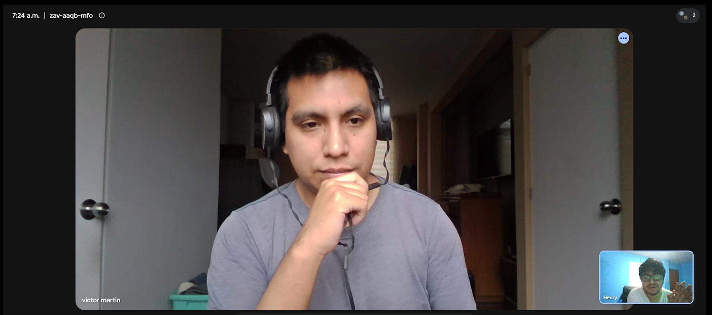

## 2.2. Entrevistas

### 2.2.1.  Diseño de entrevistas

#### Objetivos

Recoger información sobre las necesidades, expectativas, dificultades y posibles preocupaciones de los administradores de galerías comerciales respecto a la gestión de la seguridad, la detección de incidentes y el control del consumo de servicios básicos como agua y energía.

### Preguntas - Administrador de Galería

##### Datos básicos

* ¿Cuál es su nombre, edad y función dentro de la galería?
* ¿Cuántos locales aproximadamente tiene la galería que administra?
* ¿Cuáles son sus principales responsabilidades dentro de la administración de la galería?

##### Gestión actual

* ¿Cómo realiza actualmente el control y supervisión de los locales y áreas comunes?
* ¿Con qué frecuencia realiza recorridos o inspecciones presenciales?
* ¿Qué herramientas utiliza actualmente para registrar y consultar información de la galería?
* ¿Qué actividades de la administración considera que le toman más tiempo o esfuerzo?

##### Seguridad e incidentes

* ¿Cómo se detecta actualmente un intento de ingreso no autorizado o una intrusión en la galería?
* ¿Qué sucede cuando ocurre un incidente de seguridad fuera del horario de atención?
* ¿Cómo se registra y verifica actualmente un incidente de seguridad?
* ¿Cómo se detecta actualmente la presencia de humo o un posible incendio?
* ¿Qué dificultades ha tenido para recibir o comunicar rápidamente una alerta ante este tipo de situaciones?

##### Consumo y facturación

* ¿Cómo se mide actualmente el consumo de agua y energía de cada local?
* ¿Cómo se calcula actualmente el monto que corresponde pagar a cada inquilino por estos servicios?
* ¿Qué problemas o reclamos suelen presentarse respecto al cobro de los servicios?
* Cuando un inquilino cuestiona un cobro, ¿cómo verifica actualmente que el monto sea correcto?
* ¿Qué información le sería útil consultar para comparar el consumo actual con períodos anteriores?

##### Información y necesidades

* ¿Qué información considera más importante tener disponible para conocer el estado general de la galería?
* ¿Qué tipo de alertas considera que deberían comunicarse inmediatamente al administrador?
* ¿Qué información le gustaría poder consultar desde una computadora o teléfono para facilitar su trabajo?
* Si pudiera automatizar una actividad de la administración, ¿cuál elegiría y por qué?

##### Sobre una solución tecnológica

* ¿Qué características debería tener una plataforma para que realmente facilite la administración de la galería?
* ¿Qué tan importante sería para usted contar con información histórica sobre incidentes y consumo de servicios?
* ¿Qué importancia tendría que el sistema continúe registrando eventos aunque temporalmente se pierda la conexión a Internet?
* ¿Qué preocupaciones tendría antes de implementar sensores y una plataforma IoT en la galería? (Ej. costo, instalación, mantenimiento, conectividad o facilidad de uso)

##### Cierre

* ¿Consideraría utilizar una solución tecnológica que ayude a automatizar la seguridad y el control de los servicios de la galería?
* ¿Estaría dispuesto/a a participar en futuras pruebas o evaluaciones de una solución como esta?

### 2.2.2. Registro de entrevistas

*Segmento Objetivo - Administrador de galería*

<table border="1">
  <tr>
    <th>Entrevista</th>
    <td>1</td>
    <th>Nombre</th>
    <td>Alvaro Lazarte</td>
  </tr>
  <tr>
    <th>Edad</th>
    <td>27</td>
  </tr>
  <tr>
    <th>Captura de la entrevista: </th>
    <td colspan="3">
    En la entrevista, el administrador de la galería, Alvaro Lazarte, de 27 años, comenta que gestiona una galería con aproximadamente 120 locales y que sus principales responsabilidades son controlar pagos, servicios, mantenimiento, seguridad y atención a los comerciantes. Actualmente, realiza recorridos presenciales y utiliza Excel, documentos físicos y WhatsApp, lo que dificulta centralizar la información y genera mayor esfuerzo en el control de pagos, consumos e incidentes. En cuanto a la seguridad, cuenta con cámaras y personal de vigilancia, pero reconoce que las alertas no siempre llegan rápidamente, especialmente fuera del horario de atención, y que la detección de humo o incendios aún no está completamente automatizada. Respecto al consumo de agua y energía, considera necesario contar con un historial por local que permita comparar períodos y detectar consumos anormales. Asimismo, señala que sería importante recibir alertas inmediatas sobre incendios, humo, intrusiones, cortes de energía y consumos fuera de lo normal. Sobre una solución tecnológica, considera fundamental que sea sencilla, centralice la información, permita consultar pagos, consumos e incidentes desde un solo sistema y genere alertas en tiempo real, incluso cuando exista una pérdida temporal de conexión. Finalmente, estaría dispuesto a utilizar una solución IoT y participar en futuras pruebas, siempre que sea confiable, tenga un costo razonable y reduzca efectivamente el trabajo manual de la administración.
    </td>
  </tr>
  <tr>
    <th>URL de la grabación</th>
    <td colspan="3">
      <a href="https://drive.google.com/file/d/1rMbP-xE6WKxTHGiANGP-acsDfke0go7j/view?usp=sharing">
        Ver grabación
      </a>
    </td>
  </tr>
  <tr>
   <th>Timing</th>
    <td colspan="3">
        00:00 - 9:54
    </td>
  </tr>
</table>

<table border="1">
  <tr>
    <th>Entrevista</th>
    <td>2</td>
    <th>Nombre</th>
    <td>Luis Angel Becerra</td>
  </tr>
  <tr>
    <th>Edad</th>
    <td>26</td>
  </tr>
  <tr>
    <th>Captura de la entrevista: </th>
    <td colspan="3">
    En la entrevista, el administrador de la galería, Luis Ángel Becerra, de 26 años, comenta que gestiona una galería de aproximadamente 50 locales y que sus principales responsabilidades son supervisar los espacios, coordinar el mantenimiento, controlar los pagos de servicios y atender incidentes. Actualmente, realiza recorridos diarios y utiliza Excel, documentos físicos y WhatsApp, por lo que considera que el control de consumos, pagos, supervisión e incidentes requiere bastante tiempo. En cuanto a la seguridad, utiliza cámaras y comunicación del personal, pero señala que las alertas no siempre llegan inmediatamente cuando no se encuentra físicamente en la galería. Respecto al consumo de agua y energía, considera importante contar con registros históricos, variaciones porcentuales y comparaciones mensuales para verificar reclamos y detectar anomalías. Asimismo, considera necesarias alertas inmediatas ante intrusiones, incendios, fugas de agua, cortes de energía y otras situaciones anormales. Sobre una solución tecnológica, señala que debería ser fácil de utilizar, accesible desde celular y computadora, mostrar información en tiempo real, generar alertas y conservar un historial, incluso ante pérdidas temporales de conexión. Finalmente, estaría dispuesto a implementar una solución IoT y participar en futuras pruebas, ya que considera que podría reducir el trabajo manual, mejorar el control y permitir una respuesta más rápida ante incidentes.
    </td>
  </tr>
  <tr>
    <th>URL de la grabación</th>
    <td colspan="3">
      <a href="https://drive.google.com/file/d/1RHf5ByJnad-KTE-qodMlOHUPC__yPGcn/view?usp=sharing">
        Ver grabación
      </a>
    </td>
  </tr>
  <tr>
   <th>Timing</th>
    <td colspan="3">
        00:00 - 9:10
    </td>
  </tr>
</table>

<table border="1">
  <tr>
    <th>Entrevista</th>
    <td>3</td>
    <th>Nombre</th>
    <td>Victor Ccopa</td>
  </tr>
  <tr>
    <th>Edad</th>
    <td>27</td>
  </tr>
  <tr>
    <th>Captura de la entrevista: </th>
    <td colspan="3">
    En la entrevista, el administrador de la galería, Víctor Ccopa, de 27 años, comenta que gestiona una galería de 5 locales y que sus principales responsabilidades son coordinar con los inquilinos, supervisar las áreas comunes, controlar los servicios, coordinar mantenimientos y atender incidentes. Actualmente, realiza inspecciones diarias y utiliza Excel y WhatsApp, siendo el seguimiento de pagos, consumos y reparaciones algunas de las actividades que más tiempo le demandan. En cuanto a la seguridad, cuenta con cámaras, vigilancia y detectores de humo, pero señala que existe dificultad para recibir alertas de manera inmediata cuando ocurre un incidente. Respecto al consumo de agua y energía, considera importante disponer de un historial mensual y gráficos que permitan identificar aumentos inusuales y verificar los reclamos de los inquilinos. Asimismo, considera necesarias alertas inmediatas ante incendios, humo, intrusiones, cortes de energía y consumos anormales. Sobre una solución tecnológica, considera importante que sea sencilla, accesible desde el celular y capaz de mostrar rápidamente alertas, consumos, cámaras e información de cada local, además de continuar registrando eventos ante una pérdida de conexión a Internet. Finalmente, estaría dispuesto a utilizar una solución IoT y participar en futuras pruebas, siempre que sea fácil de aprender y contribuya a mejorar el control y reducir las tareas manuales.
    </td>
  </tr>
  <tr>
    <th>URL de la grabación</th>
    <td colspan="3">
      <a href="https://drive.google.com/file/d/1KNKdMGz5W-C9XROSfspgQjtcPyQ10bX9/view?usp=sharing">
        Ver grabación
      </a>
    </td>
  </tr>
  <tr>
   <th>Timing</th>
    <td colspan="3">
        00:00 - 7:47
    </td>
  </tr>
</table>

### 2.2.3. Análisis de entrevistas

**Segmento Objetivo - Administrador de Galería**

- Los entrevistados coinciden en que la administración de las galerías actualmente depende principalmente de recorridos presenciales, Excel, registros manuales y WhatsApp, lo que dificulta centralizar la información y genera una carga considerable en actividades como el control de pagos, consumos, mantenimiento y seguimiento de incidentes. Por ello, muestran interés en una plataforma que permita gestionar la información de los locales desde un solo sistema y reducir las tareas manuales.
- En relación con la seguridad, los entrevistados consideran importante contar con alertas inmediatas ante situaciones como incendios, humo, intrusiones, cortes de energía y otros eventos anormales. Se identificó como una necesidad común mejorar la rapidez con la que la información llega al administrador, especialmente cuando este no se encuentra físicamente en la galería.
- Respecto al control de servicios, los entrevistados manifestaron dificultades relacionadas con el registro y cálculo manual del consumo de agua y energía, así como con los reclamos de los inquilinos. En este sentido, consideran necesario disponer de historiales, gráficos y comparaciones por períodos que permitan detectar consumos anormales, verificar cobros y facilitar la toma de decisiones.
- Por último, los entrevistados valoran positivamente una solución IoT que sea sencilla de utilizar, accesible desde celular y computadora y que permita visualizar consumos, incidentes, alertas y el estado de los locales en tiempo real. También consideran importante que el sistema pueda conservar los registros incluso ante una pérdida temporal de conexión a Internet. Sin embargo, señalan como principales preocupaciones el costo de implementación, instalación, mantenimiento, conectividad y facilidad de uso. En general, los tres administradores muestran disposición a probar una solución de este tipo si demuestra ser confiable y permite reducir el trabajo manual.